# PostGIS

<br>

공간정보를 DBMS에 넣어 효과적으로 관리하는 방법을 배워보겠습니다.

- [PostGIS 도커 설치하기](#postgis-도커-설치하기)
- [공간 DBMS 준비하기](#공간-dbms-준비하기)
- [PostGIS에 공간정보 올리기](#postgis에-공간정보-올리기)
- [공간 SQL 기초](#공간-sql-기초)
- [공간분석 with PostGIS](#공간분석-with-postgis)
- [공간 CLI](#공간-cli)

<br>

## PostGIS 도커 설치하기

<br>

공간 DBMS를 - PostgreSQL + PostGIS - Docker Container 로 설치하겠습니다.
컨테이너 설치는 빠른 배포, 환경 일관성, 확장성에 강점이 있습니다. 
전역환경(Windows, Mac, Linux)에 설치 할 수도 있습니다.  

참고: https://postgis.net/documentation/getting_started/

<br>

Docker Desktop 을 설치하세요.  
https://docs.docker.com/desktop/setup/install/windows-install/

<br>

`명령 프롬프트`를 `관리자 모드`로 열고 WSL 버전을 확인하고, 업데이트 또는 설치 하세요:

```cmd
# WSL 설치 확인
wsl --version
```

```cmd
# WSL 설치
wsl --install
```

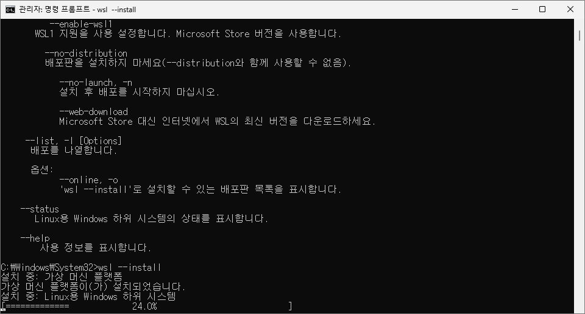
(WSL 설치가 끝나면, 시스템 재부팅일 필요합니다.)

<br>

<br>

`Docker Desktop for Windows - x86_64` 를 다운로드하고 설치하세요:

```cmd
# Docker Desktop 설치 확인
docker --version
```


```cmd
# Docker Desktop 설치
winget install --id Docker.DockerDesktop
```


<br>

PostGIS( + PostgreSQL + pgAdmin) 컨테이너를 설치 할 새 폴더 `postgis' 를 다음과 같은 폴더 구조로 만드세요:

```
postgis
  /pgdata
  docker-compose.yml
```

<br>

Docker Compose 파일을 작성하세요:

> (참고)  
> https://hub.docker.com/r/postgis/postgis  
> https://hub.docker.com/r/dpage/pgadmin4

```
# docker-compose.yml

services:
  postgis:
    image: postgis/postgis:17-3.5 # PostgreSQL 17 + PostGIS 3.5
    container_name: postgis
    restart: unless-stopped
    environment:
      POSTGRES_USER: postgres
      POSTGRES_PASSWORD: postgres
      POSTGRES_DB: gisdb  # 디폴트 DB 이름
    ports:
      - "5432:5432"
    volumes:
      - ./pgdata:/var/lib/postgresql/data # (changed in PostgreSQL 18+) /var/lib/postgresql

  pgadmin:
    image: dpage/pgadmin4:8.14
    container_name: pgadmin
    restart: unless-stopped
    environment:
      PGADMIN_DEFAULT_EMAIL: admin@admin.com   # 로그인 이메일
      PGADMIN_DEFAULT_PASSWORD: admin          # 로그인 비밀번호
    ports:
      - "8070:80"   # 브라우저에서 http://localhost:8070 접속
    # volumes:
    #   - ./pgadmin:/var/lib/pgadmin
    depends_on:
      - postgis
```

<br>

컨테이너를 생성 및 실행하세요:

```
docker-compose up -d
```

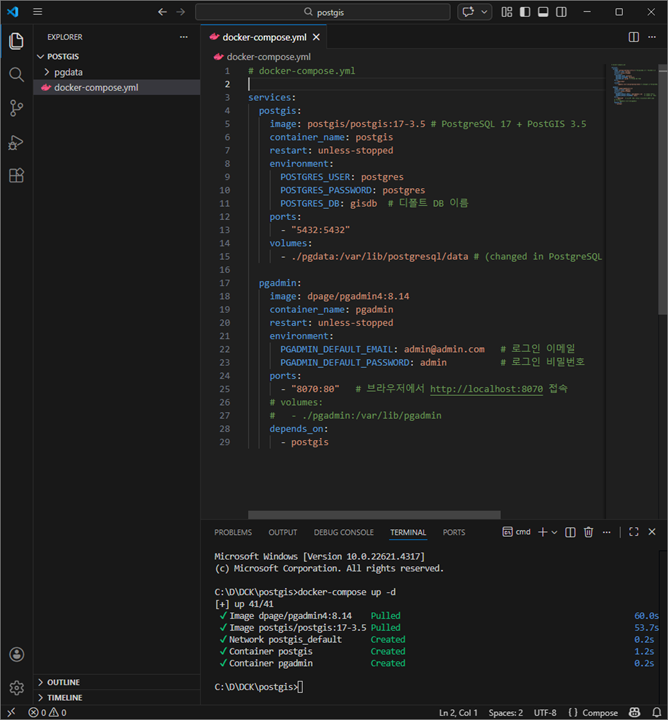

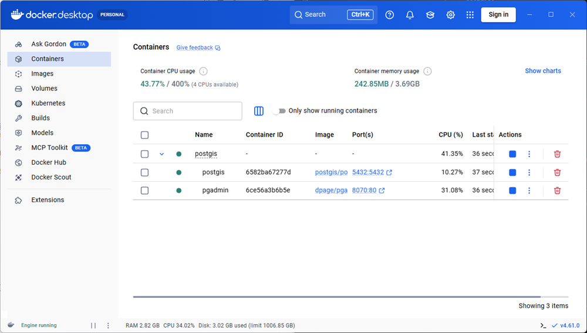

<br>

공간 DBMS를 확인해보세요: pgAdmin(http://localhost:8070) > 'Severs' > 'Register' > 'Server'

```
General > 
  Name: postgis
Connection > 
  Host name/address: postgis
  Port: 5432
  Username: postgres
```
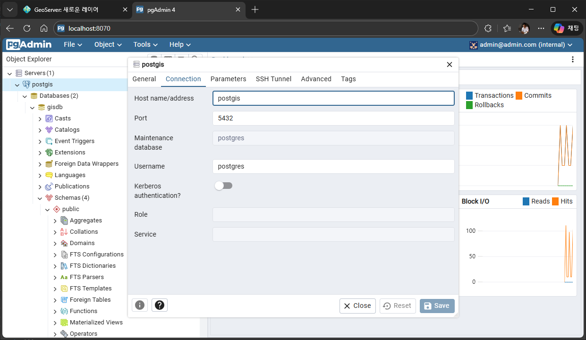

<br>

> 샘플데이터 정도는 ESRI Shape 파일로도 잘 서비스할 수 있지만, 상업적인 규모의 서비스를 하기 위해서는 공간정보를 지원하는 DBMS를 이용하는 것이 좋습니다. 공간 DBMS로 오늘 배우는 것은 PostGIS 이지만, 이 외에도 Oracle Spatial, MS SQL Server, MySQL, SpatialLite 등 여러가지 주요 DBMS가 공간정보를 다룰 수 있습니다.

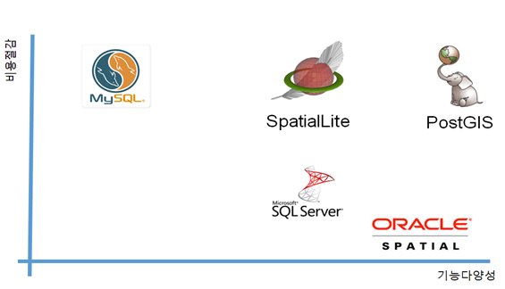

출처: https://www.slideshare.net/gis_todd/postgis-and-spatial-sql 

<br>


## 공간 DBMS 준비하기

<br>

먼저 PostgreSQL에 확장 기능인 PostGIS가 적용되도록 하겠습니다.

PostgreSQL을 관리하는 편리한 도구인 pgAdmin를 사용하겠습니다.
pgAdmin(http://localhost:8070) 을 실행하세요:

실습 암호는 `'postgres'` 입니다. 현업에서는 철저하게 보안 암호를 적용 바랍니다.

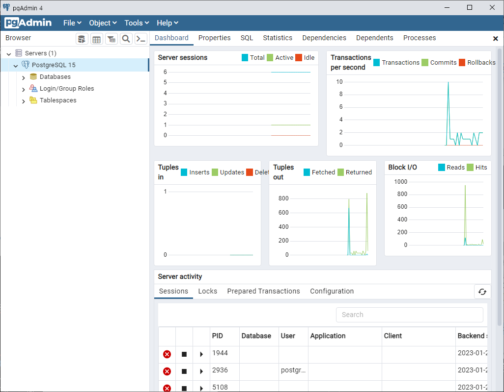

<br>

공간 DBMS를 만들어 보겠습니다. `'Databases'` 항목을 오른쪽 클릭하고 `'Create > Database...'` 메뉴를 선택합니다.

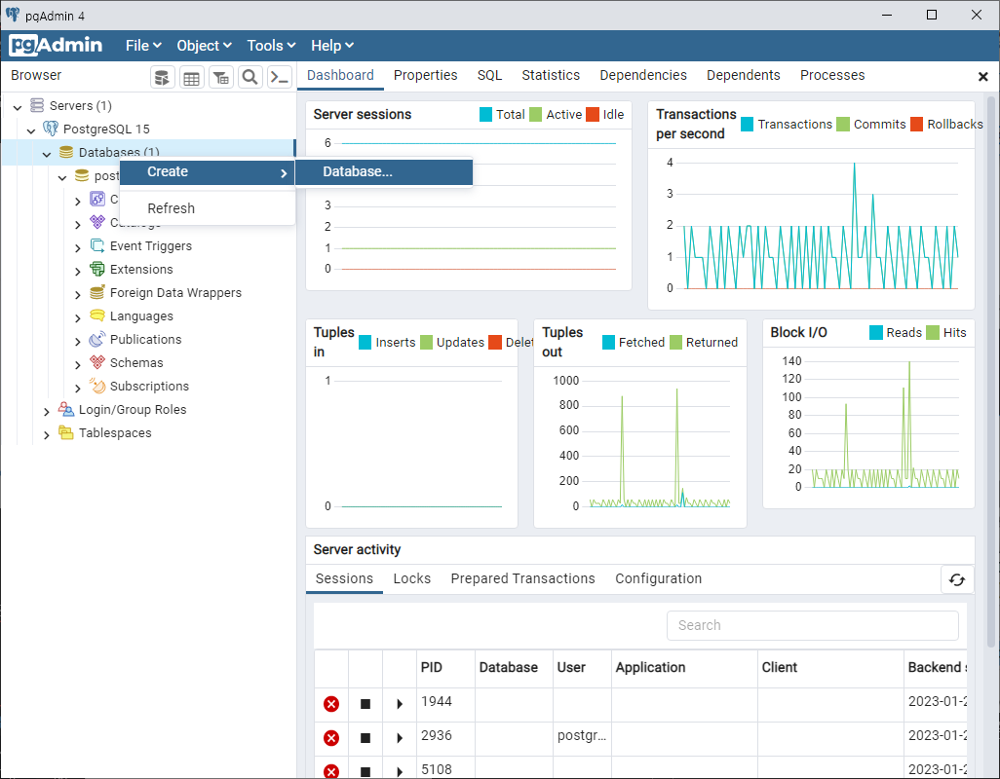

<br>

새로 만들 Database의 이름을 osgeo라 하겠습니다.
`Properties` 탭의 Name 항목에 osgeo를 입력해 주세요.
그리고 `Definition` 탭으로 가셔서 `Encoding: UTF-8, Template: template0, Collation: C, Character type: C` 를 선택하시고 [OK]를 눌러 주세요.
만약 Collation, Character type에 C가 아닌 다른 값을 선택하면 한글의 정렬과 검색에서 문제가 생길 수도 있으니 주의하세요.

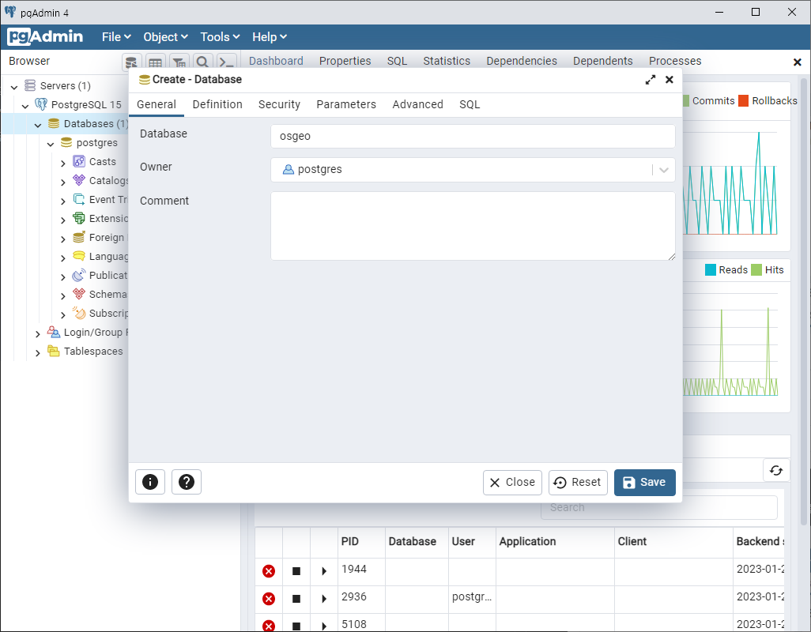

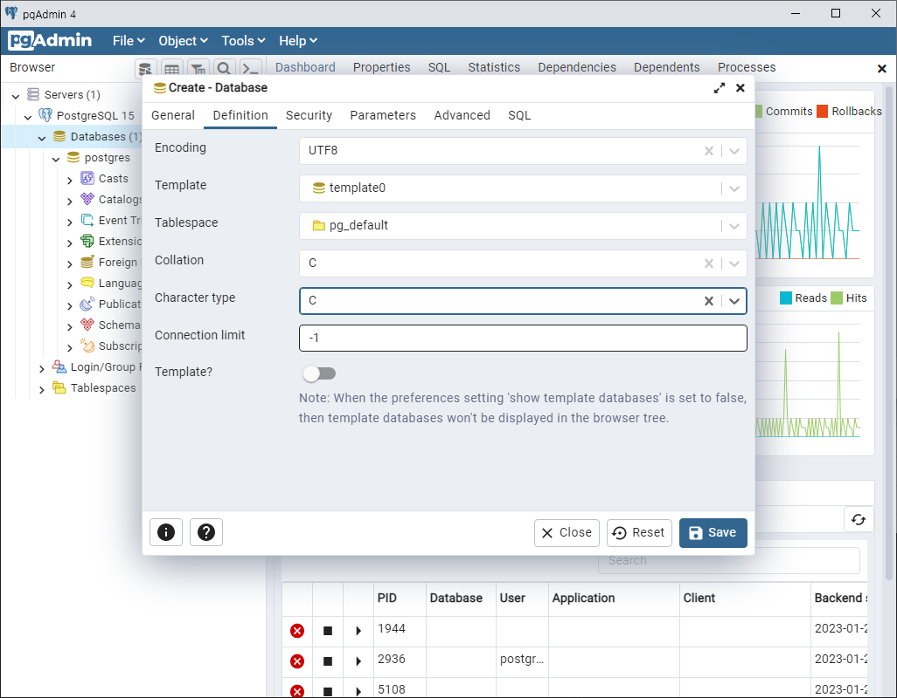

<br>

이렇게 만들어진 Database가 바로 공간자료를 다룰 수 있는 것은 아니고 한 단계를 더 거쳐야 합니다.
Databases 아래의 방금 만든 osgeo를 선택하고, [SQL] 버튼을 눌러 Query 창을 엽니다.

SQL Editor에 ```create extension postgis;```  라 입력하고 Run 버튼을 누르거나 [F5] 펑션키를 눌러 실행합니다.
이제 이 osgeo Database는 공간정보를 다룰 수 있게 되었습니다.

```
create extension postgis;
```

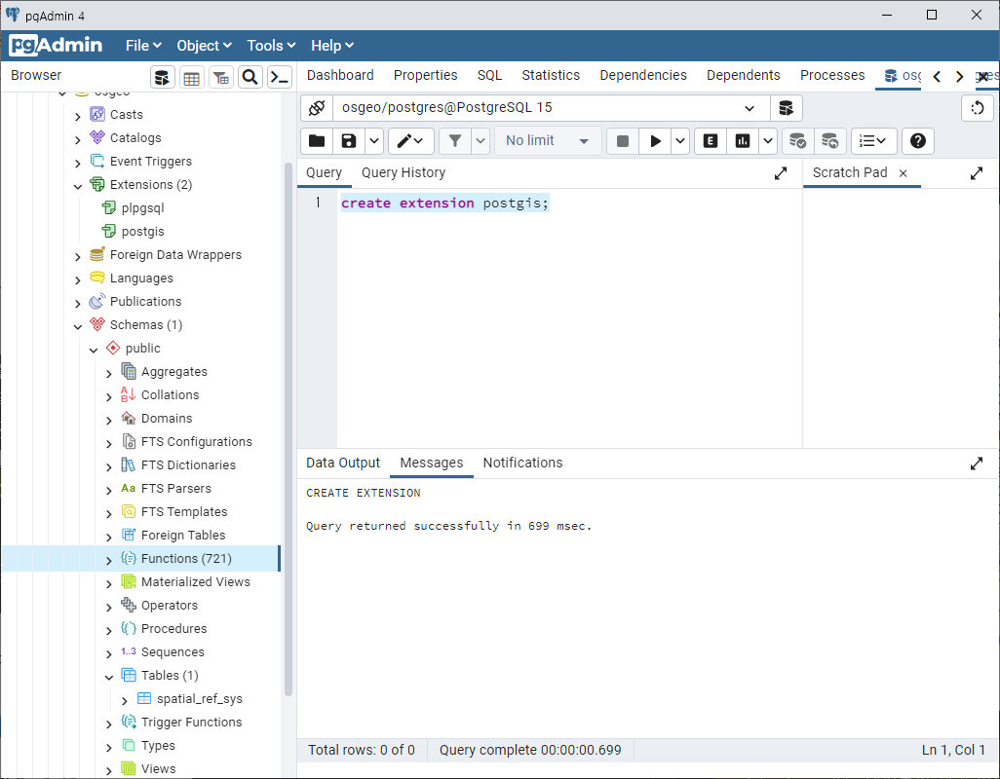

'Extensions'에 'postgis'가 들어가 있고, `'Schemas / public / Functions'` 에 펑션수가 700개가 넘게 되고, Tables에 `'spatial_ref_sys'` 라는 테이블이 생겨 있음을 보면, 아~ 공간정보를 담을 준비가 되었구나 하시면 됩니다.

<br>

spatial_ref_sys 테이블은 좌표계 정보를 담고 있는 매우 중요한 테이블입니다.
내용을 잠깐 살펴보겠습니다.
spatial_ref_sys 테이블을 선택 후 툴바에서 표 모양 아이콘을 누르면 내용을 볼 수 있습니다.
 
srid 컬럼에 숫자들이 보이고, auth_name에 EPSG라는 글자들이 보입니다. proj4text라는 컬럼에도 어디서 본 듯한 내용들이 들어있네요.
앞 시간에 배운 좌표계 정보가 들어 있다는 것을 느끼실 수 있지요?

QGIS에서 문제가 되었던 EPSG:5174 좌표계 정보를 조회해 보겠습니다.
Query 창에 SQL을 입력해 조회할 수 있습니다.
다음 SQL을 입력하고 실행해 봅시다.

```
select proj4text from spatial_ref_sys where srid = 5174;  
```

결과를 보면 여기서도 +towgs84 인자가 누락되어 있음을 확인할 수 있습니다.

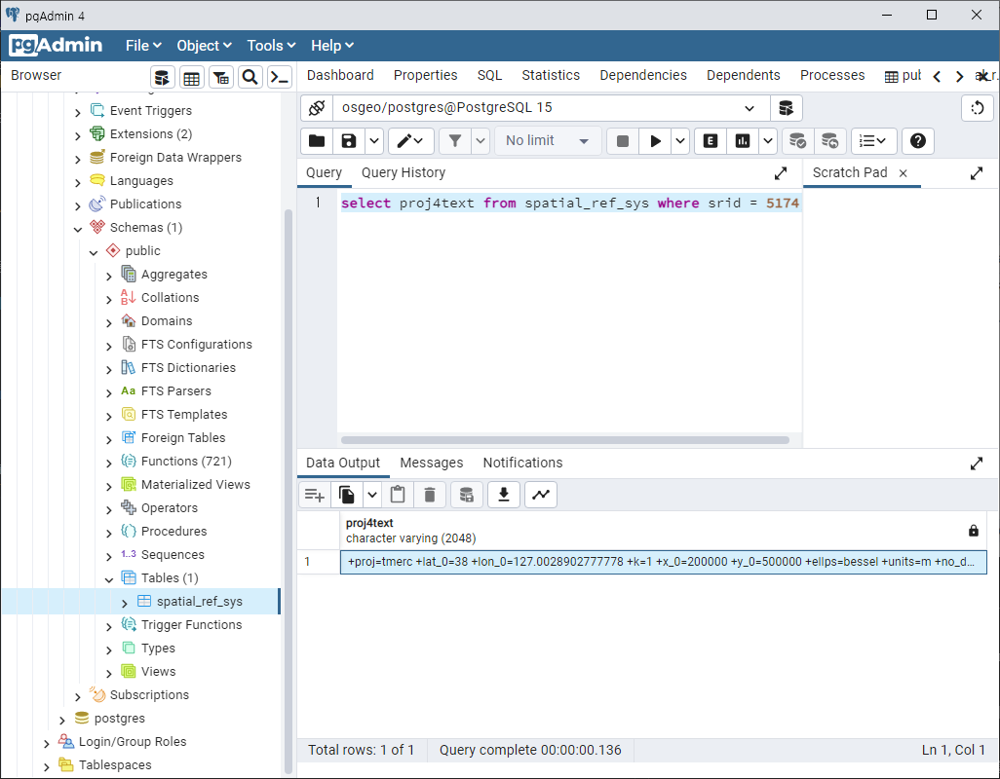

<br>

이를 바로잡기 위한 SQL이 미리 만들어져 있어 어렵지 않게 바로잡을 수 있습니다.
다음 링크로 가 보십시오.
http://www.osgeo.kr/205 


이 페이지에서 postgis_korea_epsg_towgs84.sql을 다운로드 받습니다.
Query 창에서 열기 버튼을 눌러 이 SQL 파일을 열고 [F5]눌러 실행하시면 됩니다.

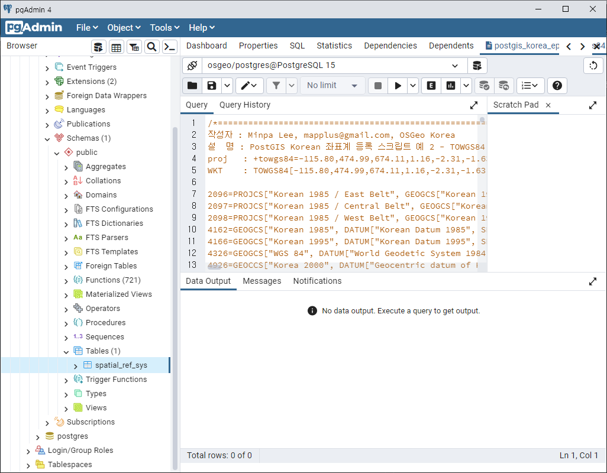

<br>

이제 PostGIS에서는 한국 좌표계들이 정상적으로 좌표계 변환이 됩니다.
이렇게 PostGIS를 활성화시키고 한국 좌표계를 정정하는 작업은 새로운 Database를 만들때만 하면 됩니다.


<br>


## PostGIS에 공간정보 올리기

<br>

공간 DBMS를 만들었으니 이제 공간정보를 올려보겠습니다.
먼저 실습에 사용할 파일을 받겠습니다.
다음 링크의 자료를 받아 주세요.   
https://github.com/Gaia3D/workshop/raw/master/20171208_%EC%84%9C%EC%9A%B8%EC%97%B0_%EA%B3%B5%EA%B0%84SQL/data.zip

다운로드 받은 자료를 C:\data 폴더에 풀어주세요.
먼저 한글 코드페이지를 확인해 보기 위해 QGIS에서 자료를 열어보겠습니다.
admin_emd를 열어보니 한글이 다 깨져 보이는군요. 
좌표계는 5186으로 확인됩니다.

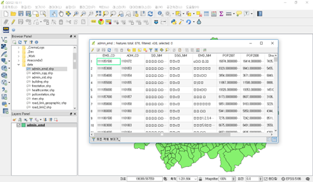

<br>

데이터 소스 코드화 값을 'windows-949(cp949 또는 ms949)'로 바꾸니 정상적으로 보입니다.
이 데이터들은 대부분 윈도우에서 사용하는 cp949 코드페이지를 사용하고 있습니다.

단 한 레이어만 코드페이지가 다른데, road_link_geographic 입니다. 좌표계도 4326입니다.

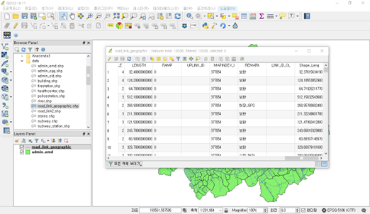

<br>

공간정보를 PostGIS에 올릴 수 있는 도구와 방법은 여러가지가 있습니다.
본 실습에서는 QGIS 뿐만 아니라 GDAL(ogr2ogr)을 활용한 방법까지 알아보겠습니다.

<br>

### QGIS 활용하여 PostGIS에 공간정보 올리기

<br>

`QGIS` 실행하고 `탐색기`에서 `PostgreSQL` 를 찾아서 마우스를 우클릭하여서 `새 연결`을 실행하세요.

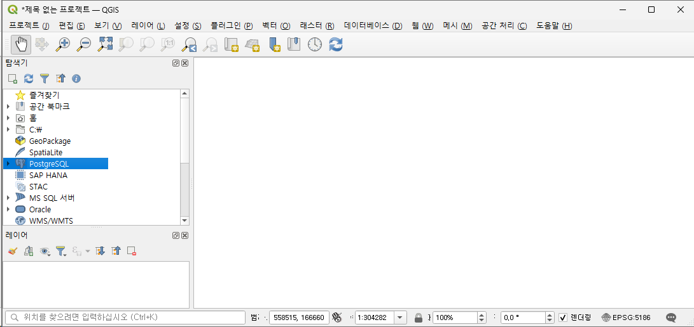

<br>

다음과 같이 연결 정보를 편집하고 `연결 테스트` 하세요.

```
이름: osgeo
호스트: localhost
포트: 5432
데이터베이스: osgeo
사용자: postgres
비밀번호: postgres
```

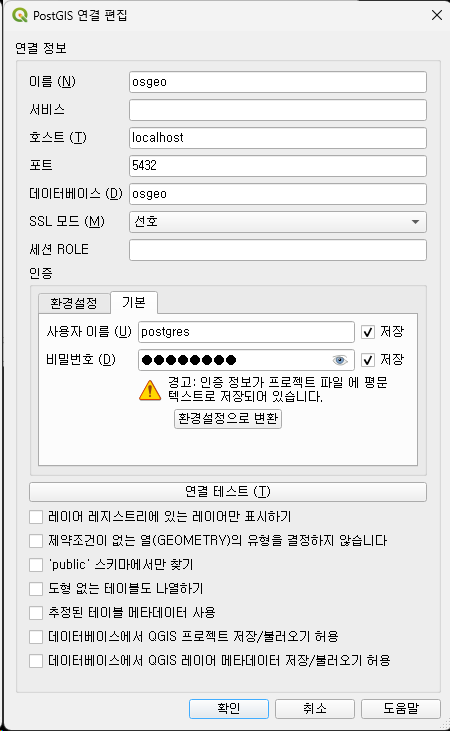

<br>

`매뉴 > 데이터베이스 > DB관리자` 실행하고, `제공자 > PostGIS > osgeo > public` 선택하고, `레이어/파일 불러오기` 실행하세요.  
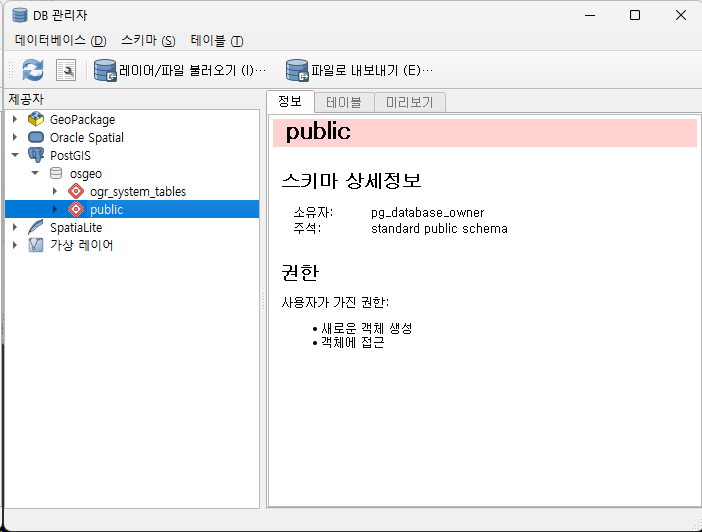

`입력: 가져올 파일`로 `/data/admin_emd.shp`을 선택하고, `확인`을 실행하세요.  
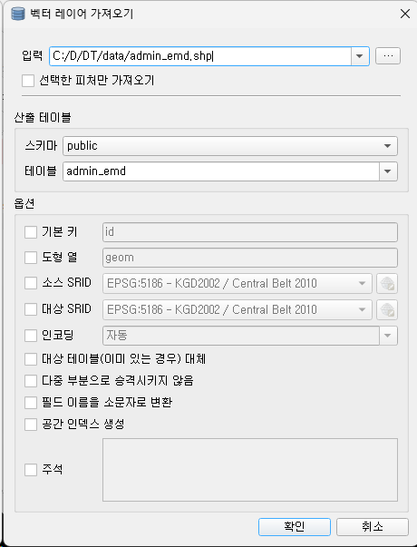

<br>

### QGIS 활용하여 PostGIS에 공간정보 여러개 올리기

<br>

`매뉴 > 공간 처리 > 공간 처리 툴박스`를 실행하세요. `PostgreSQL`을 검색하고, `PostgreSQL로 내보내기`를 실행하세요. `배치 프로세스로 실행`을 실행하세요.  
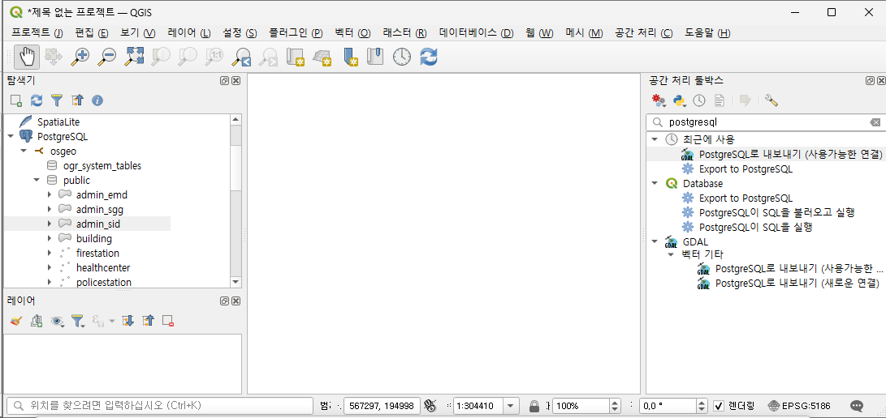

<br>

다음과 같이 편집하여 실행하세요.

```
데이터베이스(연결 이름): osgeo
입력레이어: /data/admin_sgg.shp | /data/admin_sid.shp
형태 인코딩: CP949
스키마: public
입력 속성의 너비 및 정확도 유지: X
```

주의! 입력 속성의 너비 및 정확도 유지를 해지하고 실행하세요.  
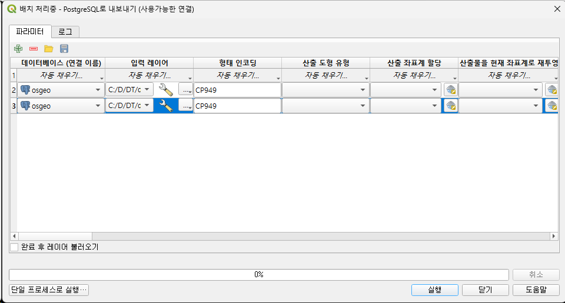  
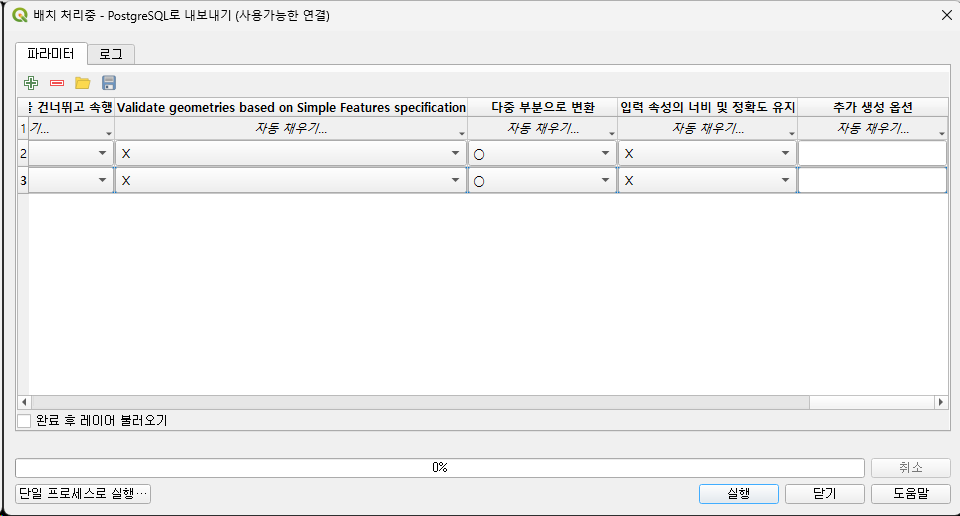

<br>

`QGIS > 탐색기 > PostgreSQL > osgeo > public` 에서 `admin_sid`, `admin_sgg`, `admin_emd` 마우스 우클릭하여 `관리 > 삭제` 하세요.

<br>

### GDAL(ogr2ogr) 활용하여 PostGIS에 공간정보 올리기

<br>


`윈도우 키> OSGeo4W Shell` 을 실행하세요. 다음 명령어를 실행하여 레이어를 올리세요.

```bash
cd c:\data
```

```bash
ogr2ogr -progress `
  --config PG_USE_COPY YES `
  --config SHAPE_ENCODING CP949 `
  -f PostgreSQL "PG:dbname='osgeo' host=localhost port=5432 user='postgres' password='postgres'" `
  -overwrite `
  -nlt PROMOTE_TO_MULTI `
  -lco GEOMETRY_NAME=geom `
  -lco FID=id `
  -lco PRECISION=NO `
  admin_sid.shp `
  -nln public.admin_sid
```

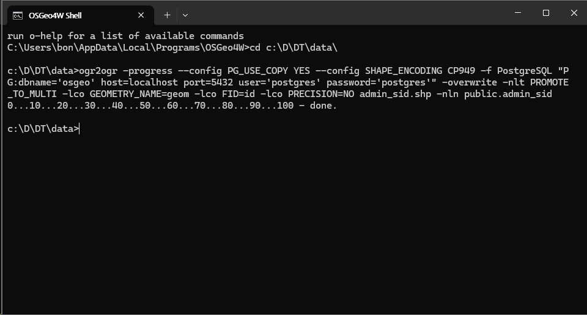

>[!NOTE]
>1. 성능 및 시스템 설정  
>-progress: 터미널에 실시간 변환 진행률(%) 표시  
>--config PG_USE_COPY YES: INSERT 대신 COPY 명령어를 사용하여 대용량 데이터 전송 속도 극대화  
>--config SHAPE_ENCODING CP949: 한국어(EUC-KR/CP949) 인코딩 지정으로 한글 깨짐 방지  
>
>2. 데이터베이스 접속 및 처리  
>-f PostgreSQL: 출력 포맷을 PostgreSQL(PostGIS)로 지정  
>-overwrite: DB에 동일한 이름의 테이블이 존재할 경우 삭제 후 새로 생성   
>
>3. 지형 정보(Geometry) 제어  
>-nlt PROMOTE_TO_MULTI: 단일 객체(Polygon 등)를 멀티 객체(MultiPolygon)로 강제 변환하여 데이터 형식 통일  
>-lco GEOMETRY_NAME=geom: 도형 정보를 저장할 컬럼 이름을 geom으로 설정  
>-lco PRECISION=NO: 숫자 필드의 정밀도를 강제로 제한하지 않고 원본 값 유지  
>
>4. 테이블 구조 및 이름 정의  
>-lco FID=id: 고유 식별자(Primary Key) 컬럼 이름을 id로 설정  
>-nln public.admin_sid: 생성될 테이블의 스키마와 이름(public 스키마의 admin_sid 테이블) 지정
  

<br>

### GDAL(ogr2ogr) 활용하여 PostGIS에 공간정보 여러개 올리기


다음과 같이 실행 파일을 작성하고 실행하여서 여러개의 공간정보를 PostGIS에 올리세요.


Shp 파일이 있는 폴더로 이동:
```Bash
cd c:\data
```


`OSGeo4W Shell` 환경실행파일 찾기(cmd):
```Bash
where /r C:\ o4w_env.bat
```


공강정보 여러개 올리기 실행파일 작성하기(cmd):
```Bash
# import_shps.cmd

@echo off
setlocal enabledelayedexpansion

:: 1. 사용자 설정
set OSGEO4W_ENV="C:\Users\bon\AppData\Local\Programs\OSGeo4W\bin\o4w_env.bat"
set DB_CONN="PG:dbname='osgeo' host='localhost' port='5432' user='postgres' password='postgres'"
set TARGET_SCHEMA=public
set SRID=5186
set ENCODING=CP949

:: OSGeo4W 환경 로드
if not exist %OSGEO4W_ENV% (
    echo [ERROR] OSGeo4W 환경 파일을 찾을 수 없습니다: %OSGEO4W_ENV%
    pause
    exit /b
)
call %OSGEO4W_ENV%

echo ">>> Batch Import Started..."

:: 2. 모든 .shp 파일 루프 실행
for %%f in (*.shp) do (
    set FILE_NAME=%%f
    set TABLE_NAME=%%~nf

    echo.
    echo [Processing] !FILE_NAME! ---^> %TARGET_SCHEMA%.!TABLE_NAME!

    ogr2ogr -progress ^
--config PG_USE_COPY YES ^
--config SHAPE_ENCODING %ENCODING% ^
-f PostgreSQL %DB_CONN% "%%f" ^
-nln %TARGET_SCHEMA%.!TABLE_NAME! ^
-overwrite ^
-nlt PROMOTE_TO_MULTI ^
-s_srs EPSG:%SRID% ^
-t_srs EPSG:%SRID% ^
-lco GEOMETRY_NAME=geom ^
-lco FID=id ^
-lco PRECISION=NO

    if !errorlevel! equ 0 (
        echo [SUCCESS] !TABLE_NAME! 테이블 생성 완료.
    ) else (
        echo [FAILED] !FILE_NAME! 임포트 중 오류 발생.
    )
)

echo.
echo ">>> All files processed."
pause
```


공간정보 여러개 올리기기 실행하기(cmd):
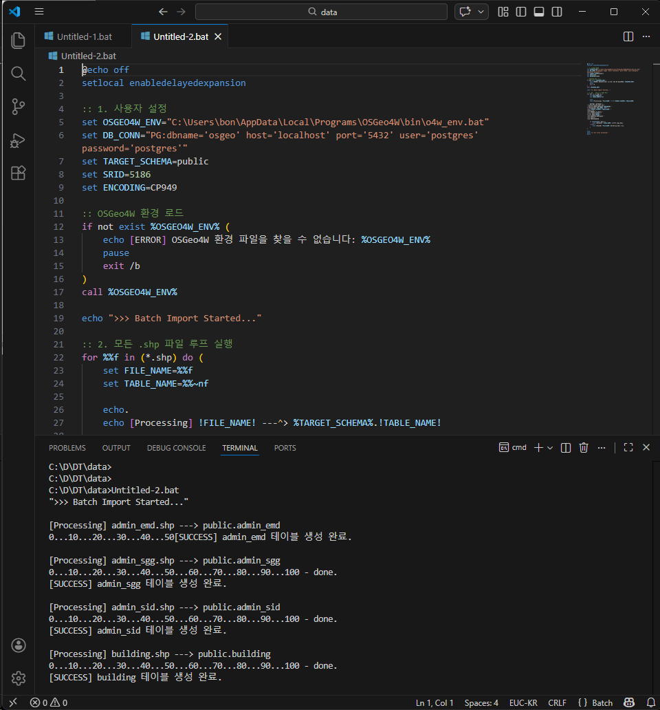


>[!important]
QGIS에서 `road_link_geographic` 레이어의 좌표체계 및 인코딩을 확인하고, 다시 업로드하세요.
`OSGeo4W Shell` 대신 `명령프롬프트(CMD)` 에서도 다음과 같이 환경실행 파일을 찾아서 실행할 수 있음.


환경실행파일 실행(cmd):
```Bash
C:\Users\bon\AppData\Local\Programs\OSGeo4W\bin\o4w_env.bat

# 다시 확인
ogr2ogr --version
```

`road_link_geographic` 레이어 다시 올리기:
```Bash
ogr2ogr -progress --config PG_USE_COPY YES --config SHAPE_ENCODING UTF-8 -f PostgreSQL "PG:dbname='osgeo' host=localhost port=5432 user='postgres' password='postgres'" -overwrite -nlt PROMOTE_TO_MULTI -lco GEOMETRY_NAME=geom -lco FID=id -lco PRECISION=NO road_link_geographic.shp -nln public.road_link_geographic -s_srs EPSG:4326 -t_srs EPSG:4326
```


>[!note]
>`OSGeo4W Shell` 대신 `파워쉘(pwsh)` 사용 한다면,

환경실행파일 찾기(pwsh):
```Bash
Get-ChildItem -Path C:\ -Filter o4w_env.bat -Recurse -ErrorAction SilentlyContinue
```

환경실행파일 실행(pwsh):
```Bash
# 이 두 줄을 복사해서 붙여넣으세요
$env:Path += ";C:\Program Files\QGIS 3.44.9\bin"
$env:GDAL_DATA = "C:\Program Files\QGIS 3.44.9\share\gdal"

# 다시 확인
ogr2ogr --version
```

공간정보 여러개 올리기 실행파일 작성(pwsh):
```shell
# import_shps.ps1

# 1. 사용자 설정
$OSGEO4W_ENV = "C:\Program Files\QGIS 3.44.9\bin\o4w_env.bat"
$DB_CONN = "PG:dbname='osgeo' host='localhost' port='5432' user='postgres' password='postgres'"
$TARGET_SCHEMA = "public"
$SRID = "5186"
$ENCODING = "CP949"

# 2. OSGeo4W 환경 로드 (파일이 있을 때만 경로 추가)
if (Test-Path $OSGEO4W_ENV) {
    # 배치파일의 디렉토리 경로를 추출하여 환경 변수에 추가
    $binPath = Split-Path -Path $OSGEO4W_ENV -Parent
    if ($env:Path -notlike "*$binPath*") {
        $env:Path += ";$binPath"
        
        # GDAL 데이터 경로 설정 (C:\Program Files\QGIS 3.44.9\share\gdal)
        $parentPath = Split-Path $binPath -Parent
        $env:GDAL_DATA = Join-Path $parentPath "share\gdal"
        
        Write-Host "[INFO] QGIS GDAL 환경 로드 완료." -ForegroundColor Green
    }
} else {
    Write-Error "[ERROR] OSGeo4W 환경 파일을 찾을 수 없습니다: $OSGEO4W_ENV"
    Write-Host "팁: QGIS 설치 경로가 맞는지, 버전 숫자가 3.44.9가 맞는지 확인해 주세요." -ForegroundColor Yellow
    Pause
    exit
}

Write-Host ">>> PowerShell Import Started..." -ForegroundColor Cyan

# 3. 모든 .shp 파일 루프 실행
$shpFiles = Get-ChildItem -Filter *.shp

if ($shpFiles.Count -eq 0) {
    Write-Host "[NOTICE] 현재 폴더에 .shp 파일이 없습니다." -ForegroundColor Magenta
}

foreach ($file in $shpFiles) {
    $tableName = $file.BaseName # 확장자 제외 파일명
    
    Write-Host "`n[Processing] $($file.Name) ---> $TARGET_SCHEMA.$tableName" -ForegroundColor Yellow

    # ogr2ogr 실행 (백틱 ` 기호로 줄바꿈)
    # 포트번호 등 DB_CONN 정보를 사용하여 접속합니다.
    ogr2ogr -progress `
        --config PG_USE_COPY YES `
        --config SHAPE_ENCODING $ENCODING `
        -f PostgreSQL $DB_CONN "$($file.FullName)" `
        -nln "$TARGET_SCHEMA.$tableName" `
        -overwrite `
        -nlt PROMOTE_TO_MULTI `
        -s_srs "EPSG:$SRID" `
        -t_srs "EPSG:$SRID" `
        -lco GEOMETRY_NAME=geom `
        -lco FID=id `
        -lco PRECISION=NO

    # 실행 결과 확인 ($LASTEXITCODE는 마지막 외부 명령의 종료 코드)
    if ($LASTEXITCODE -eq 0) {
        Write-Host "[SUCCESS] $tableName 테이블 생성 완료." -ForegroundColor Green
    } else {
        Write-Host "[FAILED] $($file.Name) 임포트 중 오류 발생." -ForegroundColor Red
    }
}

Write-Host "`n>>> All files processed." -ForegroundColor Cyan
Pause
```

<br>
## 공간 SQL 기초

<br>

먼저 간단한 일반 SQL 부터 시작해 보겠습니다.
pgAdmin으로 가서 새 Query 창을 띄우고 실습하시면 됩니다.
pgAdmin(http://localhost:8070) 을 실행하세요.

<br>

```sql
SELECT *
FROM stores;
```

매장들이 들어있는 store 테이블의 내용을 모두 보는 쿼리입니다.
공간데이터 컬럼이 어찌 보이는지는 한번 더 확인해 보세요.
혹시 빈칸처럼 보여도 실제로는 비어있지는 않습니다.

<br>

```sql
SELECT *
FROM stores
WHERE brand='이마트';
```

매장 중 이마트만 필터링해 보는 쿼리입니다.

<br>

```sql
SELECT COUNT(nam)
FROM stores
WHERE addr like '%영등포구%';
```

영등포구의 매장만도 간단히 필터링 할 수 있습니다.

<br>

```sql
SELECT brand, COUNT(nam) as "점포수"
FROM stores
GROUP BY brand;
```

각 브랜드별 점포수를 조회하기 위해 집계 함수인 COUNT를 사용했습니다.
집계함수를 사용할 때는 보통 GROUP BY 문이 필요합니다.

<br>

```sql
SELECT brand, AVG(char_length(nam)), STDDEV(char_length(nam))
FROM stores GROUP BY brand;
```

평균과 분산을 구하는 정도는 DB에게는 일도 아니지요.

<br>

```sql
SELECT ST_AsText(geom)
FROM firestation;
```

드디어 공간 SQL입니다. 지오메트리를 텍스트로 만들어 사람이 알아볼 수 있는 형태로 조회했네요.
ST_로 시작하는 함수가 공간 SQL을 위한 함수입니다.

<br>

```sql
SELECT link_id, ST_Length (geom)
FROM road_link_geographic;
```

길이를 구하는 것 쯤이야 쉽지요.

<br>

```sql
SELECT link_id, ST_Length(ST_Transform(geom,5179))
FROM road_link_geographic;
```

하지만, 경위도 등 미터단위가 아닌 좌표계에서 거리나 면적을 계산하면 엉뚱한 값이 나옵니다.
이럴 때는 미터단위를 사용하는 좌표계로 변환하여 계산하면 됩니다.

<br>

```sql
SELECT ufid, ST_Area(ST_Transform(geom,5179))
FROM building
LIMIT 100;
```

면적도 어려울 것이 없지요. 
마지막 줄의 LIMIT 100은 결과중 100개만 보여주는 것인데, 자료량이 많을 때 테스트시 특히 유용합니다.
웹에서의 페이징 등의 조회기법을 위해서도 사용합니다.

<br>

```sql
SELECT ufid, ST_Area(geom)
FROM building
LIMIT 100;
```

하지만, 앞에서의 SQL에는 불필요한 좌표계 변환이 들어있습니다.
원 자료의 5186 좌표계도 미터단위 TM 직각좌표계고, 변환한 5179 좌표계도 미터단위 TM 직각좌표계여서 둘 좌표계가 타원체가 다르기는 하지만 면적 계산시에는 전혀 좌표계 변환할 필요가 없습니다.

<br>

```sql
ALTER TABLE stores
ADD Column buffer geometry(Polygon,4326);
```

기존 테이블에 공간데이터를 저장할 수 있는 컬럼을 추가하는 것도 쉽습니다.
이제 sotres 테이블은 한 행당 2가지 공간자료가 들어갈 수 있게 되었습니다.

<br>

```sql
UPDATE stores
SET buffer=ST_Transform(ST_Buffer(geom, 30), 4326);
```

이렇게 하면 방금 만든 buffer라는 컬럼에 실제로 30미터 버퍼를 만든 것을 경위도로 변환해 저장하게 됩니다.
만약 경위도로 들어오는 사람이나 자동차의 실시간 위치를 파악해 점포주변 30미터에 들어오면 쿠폰을 발송하는 등의 시스템을 만들려면 이렇게 자료를 다음어 두면 좋겠지요.

<br>

```sql
SELECT ST_AsGeoJSON(ST_Transform(geom, 4326))
FROM stores;
```
```sql
SELECT ST_AsGML(geom) FROM stores;
```

인터넷 상에서 자료를 교환할 때 보통 JSON이나 XML을 사용합니다.
공간정보를 위한 JSON이 GeoJSON이라는 표준이고, XML의 경우는 GML이란 표준입니다.

주의할 것은 위의 ST_AsGeoJSON, ST_AsGML 함수는 도형부분만을 반환하고 속성은 넣어주지 않는다는 것입니다. 실제로 교환시에는 아래 예처럼 속성까지 포함된 완전한 형태로 전달하도록 코딩해 주어야 합니다.

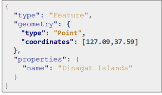
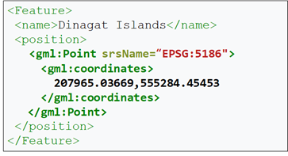

<br>

```sql
SELECT ST_NPoints(geom) as num_point
FROM road_link2
ORDER BY num_point DESC
limit 100;
```

도형이 몇 개의 점으로 이루어졌는지 등 도형에 관한 상세한 정보도 조회할 수 있습니다.

<br>

```sql
SELECT shop.nam as "매장명", metro.nam as "인근역"
FROM stores as shop, subway_station as metro
WHERE ST_Intersects(ST_Buffer(shop.geom, 500), metro.geom);
```

앞에서도 해 봤듯이 공간연산을 조건절에 추가해 공간을 기준으로 JOIN 할 수도 있습니다.

<br>

```sql
SELECT shop.nam as "매장명", metro.nam as "인근역"
FROM stores as shop, subway_station as metro
WHERE shop.addr LIKE '%영등포%'
AND ST_Intersects(ST_Buffer(shop.geom, 500), metro.geom);
```

공간연산 뿐 아니라 일반 속성에 대한 연산까지 추가해 더욱 효과적인 자료조회가 가능합니다.

<br>

본 강의에서 배우지 않는 강력한 공간 SQL 들이 많이 있습니다.
다음 링크의 PostGIS Reference에서 공간정보 함수들의 정보를 얻을 수 있습니다.   
https://postgis.net/documentation/manual/

<br><br>

## 공간분석 with PostGIS

<br>

이전시간에 실습해본 공간데이터를 저장할 수 있는 환경을 만들고, 공간자료를 DB에 올리는 작업이 실은 내부적으로는 공간 SQL을 통해 이루어 졌었습니다.
공간 SQL로 자료를 올렸으니, 불러올 수도 있겠지요? 불러 올 때 공간정보를 조건으로 줄 수도 있습니다.
또 QGIS 엔진들이 제공하는 공간자료 분석기능도 상당수 공간 SQL로 제공되고 있어 복잡한 분석도 가능합니다.

GIS 엔진이 파일을 직접 읽는 형태를 1세대, 용량 등의 한계를 극복하기 위해 여기에 RDBMS가 붙어 속성자료를 처리하는 형태가 2세대, 공간 RDBMS를 이용하는 것이 3세대로 설명되고 있습니다.

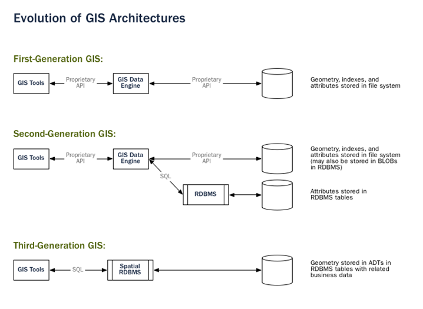   
출처: http://workshops.boundlessgeo.com/postgis-intro/introduction.html

<br>

간단한 작업을 예로 실제 공간 SQL이 어떻게 동작하고 어떤 장점이 있는지 확인해 보겠습니다.
이전시간에 PostGIS에 올려둔 자료를 가지고, 서울시내 8차선 이상 도로에서 500미터 이내 거리의 지하철역을 찾는 SQL을 여러가지 형태로 만들어 보겠습니다.

전통적인 GIS 툴에서는 아래 그림과 같은 5단계로 이 작업을 수행합니다.

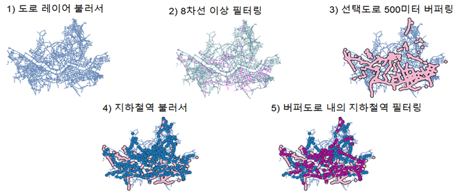

<br>

이 과정을 5가지 방식으로 공간 Python과 SQL로 만들어 보았습니다.
- 1세대 방식 : 파일기반으로 GIS 툴을 이용해 분석
- 2세대 방식 : DB에서 데이터 불러와 GIS 툴을 이용해 분석
- 3세대 방식 : 기존 분석과정 그대로 SQL로 분석
- 3세대 방식 개선 : DB에서 효율적으로 동작 가능한 SQL로 분석
- 3세대 방식 더 개선 : 더 효율적인 함수로 변경

<br><br>

### 1세대 방식 : 파일기반으로 GIS 툴을 이용해 분석

<br>

QGIS에서 이 과정을 수행할 수 있는 스크립트를 만들면 다음과 같습니다.

```python
#-*- coding: utf-8 -*- QGIS3

# 캔버스 초기화
QgsProject.instance().removeAllMapLayers()
iface.mapCanvas().refresh()

# 타이머 준비
import timeit
start = timeit.default_timer()
pre = start

# 도로 읽기
roadLayer = iface.addVectorLayer("/Data/road_link2.shp", "", "ogr")

crr = timeit.default_timer()
print (u"도로 읽기 : {}ms".format(int((crr - pre)*1000)))
pre = crr

# 8차선 이상 선택
roadLayer.selectByExpression('"LANES" >= 8', QgsVectorLayer.SetSelection)
count = roadLayer.selectedFeatureCount()
print("selected features = " + str(count))

crr = timeit.default_timer()
print (u"8차선 이상 선택 : {}ms".format(int((crr - pre)*1000)))
pre = crr

# 500미터 버퍼 분석
bufferLayer = QgsVectorLayer("Polygon?crs=epsg:5186&index=yes", "buffer500", "memory")
provider = bufferLayer.dataProvider()
bufferLayer.startEditing()
bufferFeature = QgsFeature(provider.fields())

features = roadLayer.selectedFeatures()
for feature in features:
    bufferFeature.setGeometry(feature.geometry().buffer(500, 8))
    provider.addFeatures([bufferFeature])

bufferLayer.commitChanges()
QgsProject.instance().addMapLayer(bufferLayer)
iface.mapCanvas().refresh()

crr = timeit.default_timer()
print (u"500미터 버퍼 분석 : {}ms".format(int((crr - pre)*1000)))
pre = crr

# 지하철역 읽기
stationLayer = iface.addVectorLayer("/Data/subway_station.shp", "", "ogr")

crr = timeit.default_timer()
print (u"지하철역 읽기 : {}ms".format(int((crr - pre)*1000)))
pre = crr

# 버퍼 안 지하철역 선택
for iFeature in bufferLayer.getFeatures():
    for sfeature in stationLayer.getFeatures():
        if sfeature.geometry().within(iFeature.geometry()):
            stationLayer.select(sfeature.id())

crr = timeit.default_timer()
print (u"버퍼 안 지하철역 선택 : {}ms".format(int((crr - pre)*1000)))
pre = crr

# 결과 파일 저장
QgsVectorFileWriter.writeAsVectorFormat( stationLayer, "/Data/Result.shp", "cp949", stationLayer.crs(), "ESRI Shapefile", 1)
iface.addVectorLayer("/Data/Result.shp", "result", "ogr")

crr = timeit.default_timer()
print (u"결과 파일 저장 : {}ms".format(int((crr - pre)*1000)))

print (u"========================")
print (u"전체 수행시간 : {}ms".format(int((crr - start)*1000)))

```

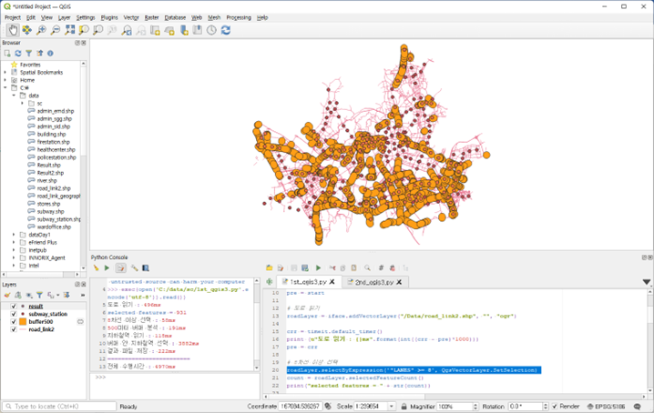

<br><br>

### 2세대 방식 : DB에서 데이터 불러와 GIS 툴을 이용해 분석

<br>
1세대 방식을 데이터 소스만 바꿔 DB에서 실행하도록 한 것입니다.
DB 접속정보를 설정하고 이를 이용해 자료를 불러오는 방식에 집중해 보시면 좋습니다.

이 샘플데이너는 너무 크기가 작아 2세대 방식의 장점을 살릴 수는 없습니다.

```py
#-*- coding: utf-8 -*- QGIS3

# 캔버스 초기화
QgsProject.instance().removeAllMapLayers()
iface.mapCanvas().refresh()

# 타이머 준비
import timeit
start = timeit.default_timer()
pre = start

# 도로(DB) 읽기
uri = QgsDataSourceUri()
uri.setConnection("localhost", "5432", "osgeo", "postgres", "postgres")
uri.setDataSource("public", "road_link2", "geom")
roadLayer = iface.addVectorLayer(uri.uri(False), "road(DB)", "postgres")

crr = timeit.default_timer()
print (u"도로(DB) 읽기 : {}ms".format(int((crr - pre)*1000)))
pre = crr

# 8차선 이상 선택
roadLayer.selectByExpression('"LANES" >= 8', QgsVectorLayer.SetSelection)
count = roadLayer.selectedFeatureCount()
print("selected features = " + str(count))

crr = timeit.default_timer()
print (u"8차선 이상 선택 : {}ms".format(int((crr - pre)*1000)))
pre = crr

# 500미터 버퍼 분석
bufferLayer = QgsVectorLayer("Polygon?crs=epsg:5186&index=yes", "buffer500", "memory")
provider = bufferLayer.dataProvider()
bufferLayer.startEditing()
bufferFeature = QgsFeature(provider.fields())

features = roadLayer.selectedFeatures()
for feature in features:
    bufferFeature.setGeometry(feature.geometry().buffer(500, 8))
    provider.addFeatures([bufferFeature])

bufferLayer.commitChanges()
QgsProject.instance().addMapLayer(bufferLayer)
iface.mapCanvas().refresh()

crr = timeit.default_timer()
print (u"500미터 버퍼 분석 : {}ms".format(int((crr - pre)*1000)))
pre = crr

# 지하철역(DB) 읽기
uri.setDataSource("public", "subway_station", "geom")
stationLayer = iface.addVectorLayer(uri.uri(False), "subway_station(DB)", "postgres")

crr = timeit.default_timer()
print (u"지하철역(DB) 읽기 : {}ms".format(int((crr - pre)*1000)))
pre = crr

# 버퍼 안 지하철역 선택
for iFeature in bufferLayer.getFeatures():
    for sfeature in stationLayer.getFeatures():
        if sfeature.geometry().within(iFeature.geometry()):
            stationLayer.select(sfeature.id())

crr = timeit.default_timer()
print (u"버퍼 안 지하철역 선택 : {}ms".format(int((crr - pre)*1000)))
pre = crr

# 결과 파일 저장
QgsVectorFileWriter.writeAsVectorFormat( stationLayer, "/Data/Result2.shp", "cp949", stationLayer.crs(), "ESRI Shapefile", 1)
iface.addVectorLayer("/Data/Result2.shp", "result2", "ogr")

crr = timeit.default_timer()
print (u"결과 파일 저장 : {}ms".format(int((crr - pre)*1000)))

print (u"========================")
print (u"전체 수행시간 : {}ms".format(int((crr - start)*1000)))

```

<br><br>

### 3세대 방식 : 기존 분석과정 그대로 SQL로 분석

<br>

이제 앞에서 해본 전통적인 GIS 작업을 그대로 SQL로 바꾼 것입니다.
얼마나 짧아졌는지에 집중해 봐 주세요.

```sql
select st.*
from subway_station as st,
(
    select st_buffer(st_union(geom), 500) as geom
    from road_link2 where lanes >=8
) as buf
where st_within(st.geom, buf.geom);
```

도로중심선 레이어에서 8차선 이상만 필터링 해, st_buffer 함수로 버퍼링하고, 그 결과를 지하철역 레이어와 st_within 함수를 조건으로 JOIN 하는 것으로 끝입니다.

<br><br>

### 3세대 방식 개선 : DB에서 효율적으로 동작 가능한 SQL로 분석

<br>

앞의 공간 SQL을 좀더 RDBMS의 장점을 살리도록 바꿀 수도 있습니다.

```sql
select * from subway_station
where gid in
(
    select distinct st.gid
    from subway_station as st, road_link2 as road
    where road.lanes >= 8
        and ST_Distance(st.geom, road.geom) <= 500
);
```
<br>

핵심은 시간이 많이 소요되는 버퍼링 과정 대신 st_distance 함수를 써서 거리 계산으로 바꿔버렸다는 것입니다. 이렇게 DBMS에서는 공간연산 보다는 숫자계산이 월씬 빠릅니다.

주의할 것은 이렇게 JOIN을 이용하는 경우 동일한 데이터가 여러번 나오는 경우가 있습니다. 이를 피하기 위해 위 소스의 앞 2줄처럼 필요한 공간객체의 id 값만을 서브쿼리 내에서 조회한 것을 다시 원하는 레이어의 where 절 조건으로 주는 것이 좋습니다.

<br><br>

### 3세대 방식 더 개선 : 더 효율적인 함수로 변경

<br>

조금 더 고민하면 이를 더 빨리 할 수도 있습니다.

```sql
select * from subway_station
where gid in
(
    select distinct st.gid
    from subway_station as st, road_link2 as road
    where road.lanes >= 8
        and ST_DWithin(st.geom, road.geom, 500)
);
```

<br>

비슷해 보이지만 st_distance 대신 st_dwithin을 사용해 거리기준 필터링을 했다는 점에서 차이가 있습니다.
st_distance를 사용한 방식에서는 모든 지하철역과 모든 도로간 거리를 다 계산해 500미터 이내만 필터링 했습니다.

하지만, st_dwithin을 사용한 방식은 내부적으로 먼저 최소영역사각형(MBR, Minimum Bounded Rectangle)으로 판단해 500미터 이내에 들어올 가능성이 없는 것은 아예 거리계산도 안하고 걸러내고 가는성이 있는 것들만 거리계산을 한다는 차이가 있습니다.

앞에서 살펴본 방식들의 성능을 비교해 본 그림입니다.
노란색의 4번째 방식이 어마어마하게 빠르지요? 그림에는 없는 5번째 방식은 4번째 방식보다 10배 정도 빠릅니다.

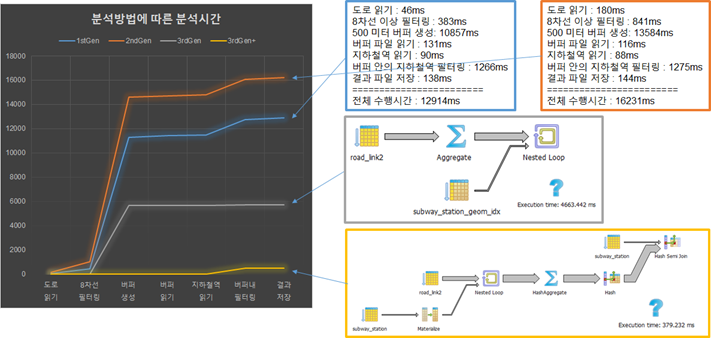

<br><br>

## 공간 CLI

<br>

공간자료 자체를 다루는 강의의 마지막 부분으로 커맨드라인 명령어(CLI, Command Line Interface)를 이용해 공간자료를 다루는 방법을 배워보겠습니다.

벡터 데이터를 다룰 때는 ogr 명령들이 주로 사용됩니다.
https://gdal.org/programs/index.html#vector-programs 
이 링크에 가면 여러가지 명령이 있는데 본 강의에서는 ogr2ogr만을 배웁니다.

윈도우 환경에서 공간정보 관련 명령어들을 쓰시려면 QGIS와 함께 설치된 OSGeo4W Shell을 이용하시는 것이 편합니다.
화면이나 키보드의 윈도우 버튼을 누르고 'osgeo4w'를 검색하시면 쉽게 찾으실 수 있을 것입니다.
혹시 안되시면 [시작] 버튼 누르시고 QGIS을 찾아 그 안에 보시면 OSGeo4W Shell이 있습니다.

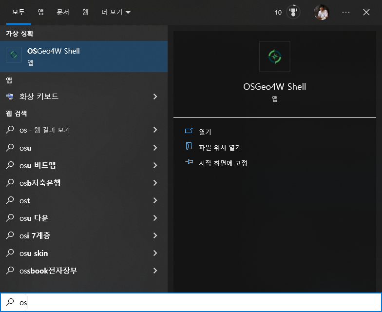

<br>

아이콘을 눌러 시작하면 검은 도스창이 나옵니다.
여기에 `ogr2ogr` 명령을 입력해서 옵션 설명이 보이면 정상 동작하는 것입니다.

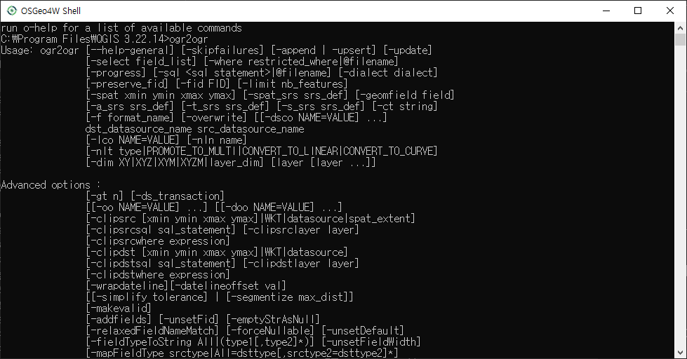

<br>

ogr2ogr로 가장 많이 하는 작업은 공간자료를 다룰 때 가장 힘든 작업인 벡터자료의 좌표계를 바꿔주는 작업입니다.
실습 자료가 들어 있는 C:\data 폴더로 이동해서 firestation 레이어를 EPSG:5174 좌표계로 변환해 보겠습니다.

```bash
cd C:\data
```

```bash
ogr2ogr -s_srs EPSG:5186 -t_srs "+proj=tmerc +lat_0=38 +lon_0=127.0028902777778 +k=1 +x_0=200000 +y_0=500000 +ellps=bessel +units=m +no_defs" -f "ESRI Shapefile" --config SHAPE_ENCODING "CP949" firestation_5174.shp firestation.shp
```

<br>

ogr2ogr의 인자를 하나씩 살펴보겠습니다.

-s_srs 인자는 원본(source) 자료의 좌표계를 의미합니다. EPSG:5186 좌표계로 지정했네요.
-t_srs 인자는 대상(target) 자료의 좌표계를 의미합니다. EPSG:5174 좌표계로 바꾼다고 했는데, 뭔가 많은 내용이 들어있네요. 이것은 ogr2ogr도 Bessel 타원체의 변환정보가 잘못되어 있기 때문입니다. 이런 경우에는 간단히 적어줄 수 없고, proj4용 좌표계 인자들을 모두 써줘야 합니다.
-f 인자는 대상자료를 어떤 포맷(format)으로 만들지를 의미합니다.
--config SHAPE_ENCODING 인자는 ESRI Shape을 다룰 때만 들어가는 추가인자로 한글 등의 코드페이지를 의미합니다.


그리고 주의할 것이 마지막 부분의 인자 순서가 다른 명령과 달리 조금 특이합니다.
대상파일 명(firestation_5174.shp)이 먼저 나오고 원본파일 명(firestation.shp)이 뒤에 나옵니다.

스크립트의 인자가 많아 생각보다 복잡했지요?
이런 좌표계 변환 작업은 QGIS에서도 쉽게 할 수 있긴 합니다. 심지어 UI가 있어 더 편합니다.
하지만, 좌표계 변환해야 하는 파일이 100개라면? 혹은 1000개라면?
많은 수의 파일을 작업해야 할 때, 혹은 아주 상세한 설정이 필요할 때 커맨드라인 명령어를 사용하면 대단히 효과적이고, 스크립트로 저장해서 실행하면 어떤 작업을 했는지 나중에도 명확히 관리할 수 있는 장점이 있습니다.

이번에는 공간자료의 파일 포맷 변환에 ogr2ogr을 사용해 보겠습니다.

```bash
ogr2ogr -f "GPKG" output.gpkg PG:"host=localhost dbname=osgeo user=postgres password=postgres schemas=public tables=admin_emd,admin_sgg,admin_sid,building,firestation,healthcenter,policestation,river,road_link2,road_link_geographic,stores,subway,subway_station,wardoffice"
```

-f 인자를 "GPKG"로 해서 만들어지는 파일 포맷을 GeoPackage로 지정했네요.

그리고 좌표계 등 다른 인자 없이 바로 대상파일과 소스 파일이 나오네요.
대상 파일은 output.gpkg 파일이군요. 이건 쉽습니다.
원본 파일은 파일이 아니네요! PostGIS 접속정보를 써 놨습니다.
특히 tables 항목에 여러 레이어를 지정해서 한꺼번에 받고 있네요.

만들어진 output.gpkg를 QGIS에서 열어 보시면 다음처럼 여러 레이어가 들어 있습니다.

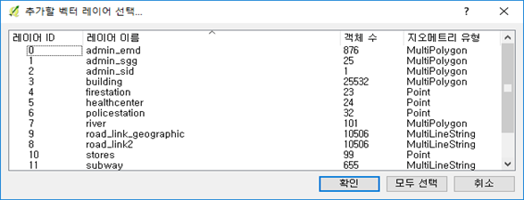

<br>

이렇게 ogr2ogr을 다양한 공간정보간의 포맷변환에 사용하실 수 있습니다. 심지어 Oracle Spatial, ArcSDE 등의 독점 소프트웨어 DBMS의 자료도 잘 다룹니다.

심지어 DBMS가 아닌 파일에도 SQL로 원하는 자료만 뽑아 낼 수 있습니다.

```bash
ogr2ogr -sql "select * from road_link2 where lanes >= 8" --config SHAPE_ENCODING "CP949" lane8.shp road_link2.shp
```

-sql 옵션으로 SQL을 실행하고 있네요. 이 SQL은 PostGIS의 SQL과는 약간 다르고 공간 SQL은 안됩니다. 

--config SHAPE_ENCODING 옵션은 CP949 인코딩의 한글이 들어있는 Shape 파일을 다룰 때는 꼭 필요합니다. 없으면 오류가 납니다.

대상파일과 원본파일은 형식을 지정하지 않았는데도 문제 없네요.
파일의 확장자나 파일 내용을 보고 OGR이 알아서 판단합니다. 
하지만, 알아서 판단하는 것이 틀리는 경우가 있기에 가능하다면 명확히 지정해 주는 것이 좋습니다.
경고들이 주욱 나오는기는 하는데요, 이는 자리수의 문제 때문이고 오류는 아닙니다.

<br>

이제 래스터 자료를 다뤄 보겠습니다.
래스터 자료용 명령어는 GDAL이 담당하고 있습니다.
https://gdal.org/programs/index.html#raster-programs 

GDAL 명령어는 목적에 따라 여러가지를 사용합니다.
먼저 래스터 데이터의 정보를 조회해 보겠습니다. 

```bash
gdalinfo BlueMarbleNG-TB_2004-12-01_rgb_3600x1800.TIFF
```

여러가지 정보를 확인할 수 있는데, 영상의 크기가 3600, 1800 로 나옵니다.
Coordinate System 부분에서 좌표계도 알 수 있습니다. ESPG:4326이니 경위도군요.
Pixel Size = (0.100000000000000,-0.100000000000000)를 보니 한 픽셀이 0.1 단위고 경위도니 0.1도 해상도 자료입니다. Y 방향에는 보통 마이너스 기호가 붙어 있습니다.
공간적 범위는 Corner Coordinates 부분을 보면 됩니다. 전지구 범위의 영상이네요.

<br>

이제 포맷 변환을 해보겠습니다.

```bash
gdal_translate -of JPEG BlueMarbleNG-TB_2004-12-01_rgb_3600x1800.TIFF WorldMap.jpg
```

-of 인자가 대상파일의 포맷을 지정하고 있습니다.

원본과 대상 파일을 지정하는 순서가 ogr2ogr과는 달리 상식적으로 원본, 대상 순임도 주의하세요.

10 메가 바이트 GeoTIFF 파일을 600 킬로 바이트 JPEG 파일로 변환했습니다.
변환된 JPEG 파일과 함께 공간정보를 담고 있는 WorldMap.jpg.aux.xml 파일도 같이 생겨서 QGIS 등의 프로그램에서 여전히 공간정보로 사용할 수 있네요.

<br>

래스터 데이터의 좌표계 변환도 많이 하는 작업입니다.

```bash
gdalwarp -s_srs EPSG:4326 -t_srs EPSG:5179 -of GTiff -r cubic -te 123 32 132 44 -te_srs EPSG:4326 BlueMarbleNG-TB_2004-12-01_rgb_3600x1800.TIFF Korea_5179.tif
```

-s_srs 인자는 원본 좌표계이고 경위도좌표계네요.
-t_srs 인자는 대상 좌표계이고 국가인터넷지도와 네이버지도에서 사용중인 GRS80타원체 UTM-K네요.
-of 인자는 대상파일 포맷임을 다 아시겠지요?
-r 인자는 대상영상의 각 픽셀값을 결정할때 원본에 있는 점들 여러개를 어찌 보간할지인데, 2차방정식을 선택했네요.
-te 인자는 대상파일을 만들 공간영역입니다. minX minY maxX maxY 순서로 적습니다.
-te_srs 인자는 -te 인자에 쓰인 좌표계가 무엇인지 설정하는 것이네요. 경위도로 했군요.
뒤에는 역시 원본파일 대상파일 순으로 적었습니다.

<br>

래스터 데이터를 빨리 보이게 하는 대표적인 방법이 미리보기(Overlay) 영상을 피라미드 처럼 다단계로 만들어 두는 것입니다.

```bash
gdaladdo -r average BlueMarbleNG-TB_2004-12-01_rgb_3600x1800.TIFF 2 4 8 16 32
```

-r 인자로 보간방법을 지정했는데 이번에는 평균법으로 했습니다.
그리고 오버레이를 만들 파일이름이 나오고 몇 개씩의 픽셀을 합쳐 오버레이를 만들지 숫자들이 나오네요.

이렇게 오버레이를 만들어 두면 QGIS나 GeoServer 등에서 큰 영상을 매우 빠른 속도로 볼 수 있습니다.
오버레이가 만들어진 영상은 QGIS의 속성창에서 피라미드 탭의 해상도 부분을 보면 확인할 수 있습니다.
오버레이가 만들어지지 않은 단계가 있는 경우 이 부분이 붉은색 아이콘으로 표시됩니다.

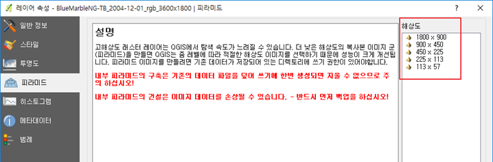

<br><br>

---
The End